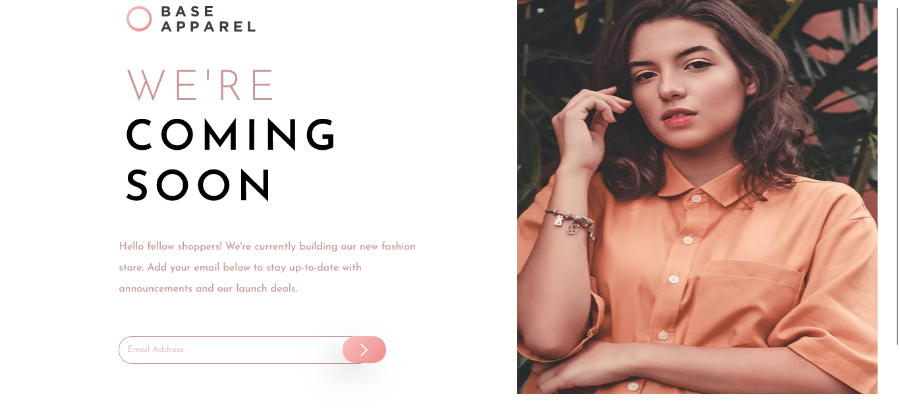

# Frontend Mentor - Base Apparel coming soon page solution

This is a solution to the [Base Apparel coming soon page challenge on Frontend Mentor](https://www.frontendmentor.io/challenges/base-apparel-coming-soon-page-5d46b47f8db8a7063f9331a0). Frontend Mentor challenges help you improve your coding skills by building realistic projects. 

## Table of contents

- [Overview](#overview)
  - [The challenge](#the-challenge)
  - [Screenshot](#screenshot)
  - [Links](#links)
- [My process](#my-process)
  - [Built with](#built-with)
  - [What I learned](#what-i-learned)
- [Author](#author)

## Overview

### The challenge

Users should be able to:

- View the optimal layout for the site depending on their device's screen size
- See hover states for all interactive elements on the page
- Receive an error message when the `form` is submitted if:
  - The `input` field is empty
  - The email address is not formatted correctly

### Screenshot



### Links

- Solution URL: [Add solution URL here](https://your-solution-url.com)
- Live Site URL: [Base Apparel](https://base-apparel-email-page.netlify.app/)

## My process

### Built with

- Semantic HTML5 markup
- CSS custom properties
- Flexbox
- Mobile-first workflow
- Vanilla JavaScript

### What I learned

I learnt strict validation and some regex

Here are some of my favorite lines of code
```html
<p id="valid"></p>
```

```js
const validateEmail = (emailVal) => {
    if(matchRegex(emailVal)) {
        errorMsg.innerHTML = ''
        errorIcon.style.display = 'none'
        emailEl.value = ''
    } else {
        errorMsg.innerHTML = 'Please enter a valid email address.'
        errorIcon.style.display = 'block'
    }
}
```

## Author

- Github - [Garvin Chimone](https://github.com/Chimoneg27)
- Frontend Mentor - [@Chimoneg27](https://www.frontendmentor.io/profile/Chimoneg27)
